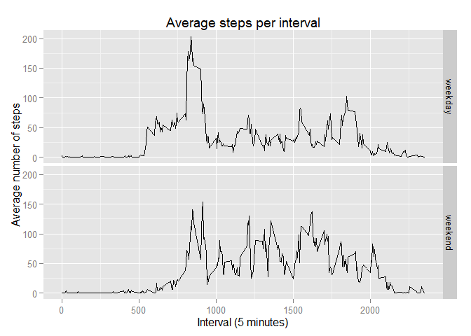

# Reproducible Research: Peer Assessment 1

This assignment uses data from a personal activity monitoring device. This device collects data at 5 minute intervals through out the day. The data consists of two months of data from an anonymous individual collected during the months of October and November, 2012 and include the number of steps taken in 5 minute intervals each day.


## Loading and preprocessing the data

Show any code that is needed to

**Load the data (i.e. read.csv())** 


```r
data<-read.csv("~/Data Science spz/R programming/RepData_PeerAssessment1/activity/activity.csv")
```

**Process/transform the data (if necessary) into a format suitable for your analysis**

To make analysis of the data easier, I have transformed the date column into date format: 


```r
data$date<-as.Date(strptime(data$date, format= "%Y-%m-%d"))
```

## What is mean total number of steps taken per day?

**Make a histogram of the total number of steps taken each day**

First, using package reshape2, I melted the dataset, to create  a new dataset with the sum of steps per day and location


```r
library(reshape2)
```

```
## Warning: package 'reshape2' was built under R version 3.1.2
```

```r
melted.data<-melt(data, id.vars=c("date", "interval"), measure.var="steps")
sum.steps<-dcast(melted.data, date ~ variable, sum)
```

This results in a data frame with two columns, the first being the date, and the second the total number of steps taken that day. 

Then we use this dataset to create the histogram 


```r
library(ggplot2)
```

```
## Warning: package 'ggplot2' was built under R version 3.1.2
```

```r
g<-ggplot(sum.steps, aes(date, steps))
g + geom_bar(aes(data=steps), stat="identity", position="dodge") +
  labs(title="Total steps per day") + 
  labs(y="total steps", x="date") 
```

 

**Calculate and report the mean and median total number of steps taken per day**

With the sum.steps dataset, we can calculate the average and median number of steps taken per day, removing the missing values. 


```r
avg.steps.per.day<-mean(sum.steps$steps, na.rm=TRUE)
avg.steps.per.day
```

```
## [1] 10766.19
```

```r
mdn.steps.per.day<-median(sum.steps$steps, na.rm=TRUE)
mdn.steps.per.day
```

```
## [1] 10765
```

## What is the average daily activity pattern?

**Make a time series plot (i.e. type = "l") of the 5-minute interval (x-axis) and the average number of steps taken, averaged across all days (y-axis)**

Using the melted data frame from the previous step, I created a new data frame with two columns, one with the interval ID and another with the average number of steps in that time. 

Using this new data frame (avg.step.interval), I created the appropriate plot. 


```r
avg.step.interval<-dcast(melted.data, interval ~ variable, mean, na.rm=TRUE)
plot(avg.step.interval$steps, type="l", main="Average number of steps per interval", xlab="Time (5 min Intervals)", ylab="Average number of steps")
```

 

**Which 5-minute interval, on average across all the days in the dataset, contains the maximum number of steps?**

Using the avg.step.interval data frame, I can find which 5 minute interval (column 1) corresponds to the maximum average steps per interval


```r
avg.step.interval[avg.step.interval$steps==max(avg.step.interval$steps),1]
```

```
## [1] 835
```

## Imputing missing values

Note that there are a number of days/intervals where there are missing values (coded as NA). The presence of missing days may introduce bias into some calculations or summaries of the data.

**Calculate and report the total number of missing values in the dataset (i.e. the total number of rows with NAs)**

Using the is.na command one can count the number of NA in the data. 


```r
sum(is.na(data))
```

```
## [1] 2304
```

**Devise a strategy for filling in all of the missing values in the dataset**

I create a new column step.narm in which the na values are substituted by the average value for that 5 minute interval. 
For each step data, I use "is.na" to assess whether a step count is emty, if true, I found the average count for that 5 minute interval and used it, if not the value remained the same. 


```r
for (i in 1:length(data$steps)){
  if (is.na(data$steps[i]))    
    data$steps.narm[i]<-avg.step.interval[avg.step.interval$interval==data$interval[265],2]
  else data$steps.narm[i]<-data$steps[i]
}
```

**Create a new dataset that is equal to the original dataset but with the missing data filled in**


```r
new.data<-data[,c("steps.narm", "date", "interval")]
```

**Make a histogram of the total number of steps taken each day and Calculate and report the mean and median total number of steps taken perday. Do these values difer from the estimates from the first part of the assignment? What is the impact of imputing missing data on the estimates of the total daily number of steps?**


```r
melted.newdata<-melt(new.data, id.vars=c("date", "interval"), measure.var="steps.narm")
new.sum.steps<-dcast(melted.newdata, date ~ variable, sum)
```

This results in a data frame with two columns, the first being the date, and the second the total number of steps (na removed) taken that day. 

Then we use this dataset to create the histogram 


```r
g<-ggplot(new.sum.steps, aes(date, steps.narm))
g + geom_bar(aes(data=steps.narm), stat="identity", position="dodge") +
  labs(title="Total steps per day without NA") + 
  labs(y="total steps", x="date") 
```

 

With the new.sum.steps dataset, we can calculate the average and median number of steps taken per day, having substituted the missing values


```r
avg.spd.nasb<-mean(new.sum.steps$steps.narm)
avg.spd.nasb
```

```
## [1] 9409.104
```

```r
mdn.spd.nasb<-median(new.sum.steps$steps.narm)
mdn.spd.nasb
```

```
## [1] 10395
```


**Do these values difer from the estimates from the ???rst part of the assignment? What is the impact of imputing missing data on the estimates of the total daily number of steps?**


```r
mn<-c(avg.steps.per.day, avg.spd.nasb)
mdn<-c(mdn.steps.per.day, mdn.spd.nasb)
comparison.steps<-data.frame(cbind(mn, mdn))
rownames(comparison.steps)<-c("NA removed", "NA substituted")
comparison.steps
```

```
##                       mn   mdn
## NA removed     10766.189 10765
## NA substituted  9409.104 10395
```


## Are there differences in activity patterns between weekdays and weekends?

For this part the weekdays() function may be of some help here. Use the dataset with the ???lled-in missing values for this part.

**Create a new factor variable in the dataset with two levels - "weekday" and "weekend" indicating whether a given date is a weekday or weekend day.**

This is done in three steps, first I assigned a new column with the weekdays (pardon for my spanish). 

Then I assign the value "weekend" or "weekday" where it applies to a new vector. 

Last I convert this new vector into a factor


```r
new.data$day<-weekdays(as.Date(new.data$date))
day.week<-character()
for (i in 1:length(new.data$day)){
  if (new.data$day[i]=="sábado"||new.data$day[i]=="domingo") 
  day.week[i]<-"weekend" else day.week[i]<-"weekday"
}
new.data$day<-factor(day.week)
```

**2. Make a panel plot containing a time series plot (i.e. type = "l") of the 5-minute interval (x-axis) and the average number of steps taken, averaged across all weekday days or weekend days (y-axis).**

I create a new melt including the new factor "day", and calculate the interval mean per type of day. 
I then create a time series plot for weekends and weekdays. 


```r
melted<-melt(new.data, id.vars=c("interval","day"), measure.var="steps.narm")
test<-dcast(melted, interval+day~variable, mean)

g<-ggplot(test, aes(interval,steps.narm)) #type=day;  group=day separates the lines
g + geom_line() + 
  labs(title="Average steps per interval") + 
  labs(x="Interval (5 minutes)", y="Average number of steps") +
  facet_grid(day ~ .)
```

 

